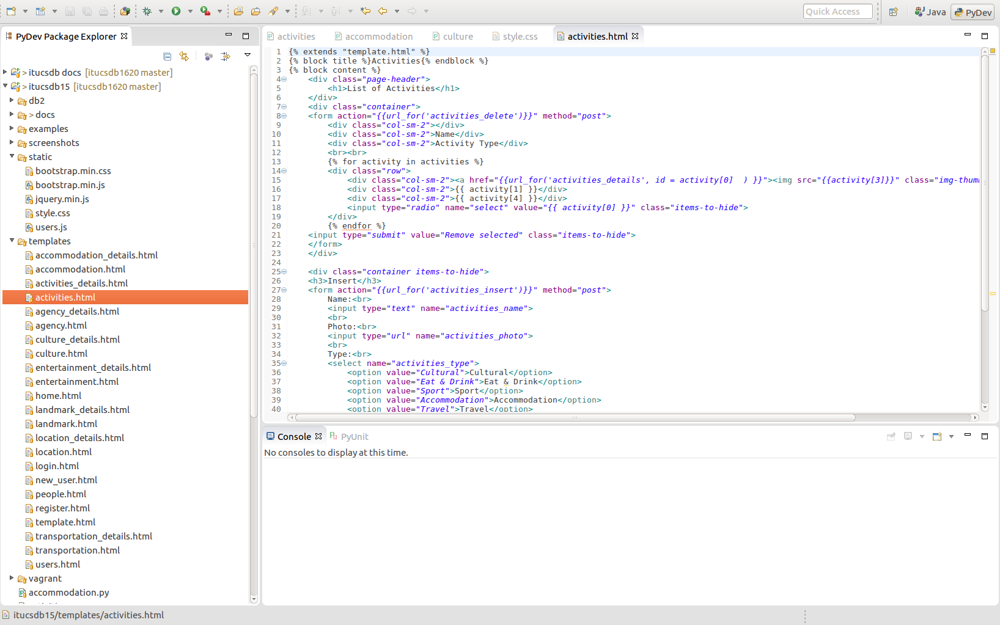
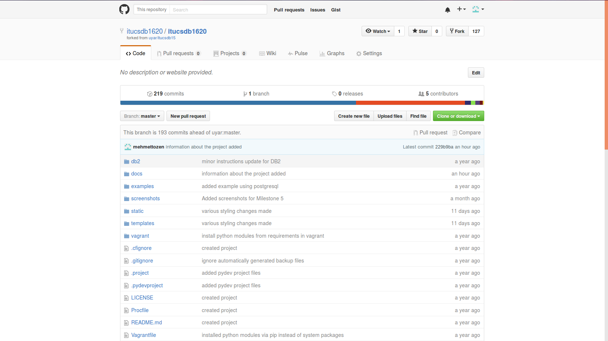
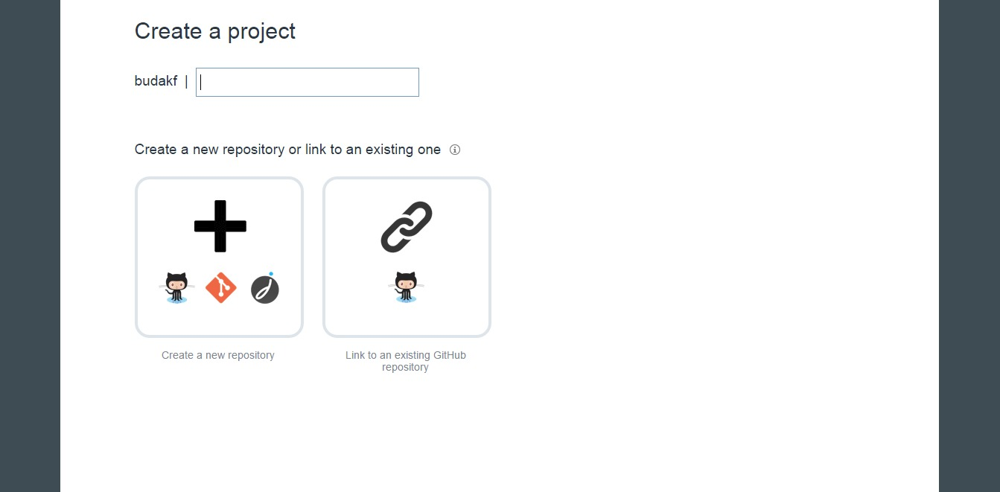
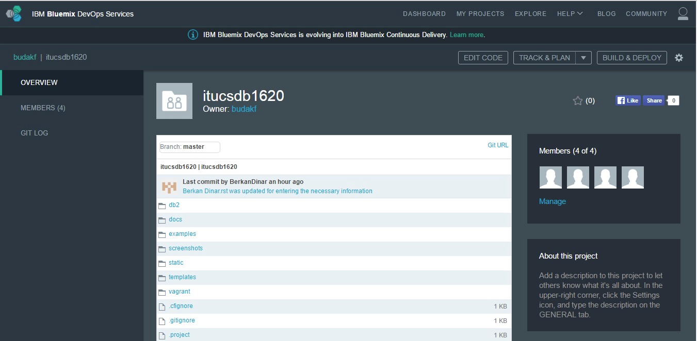
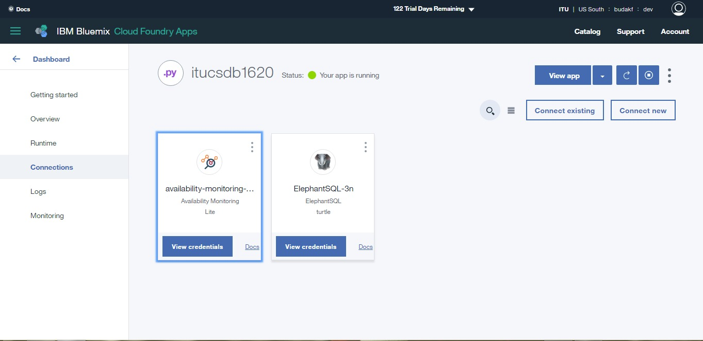
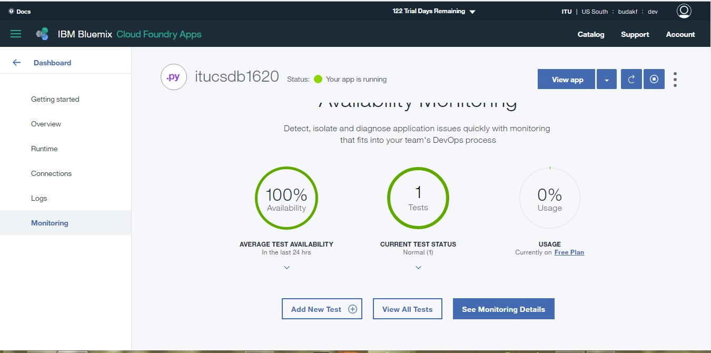
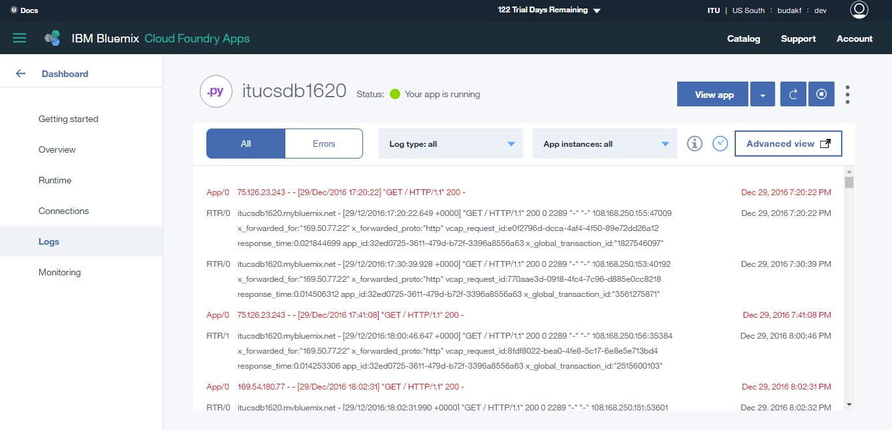
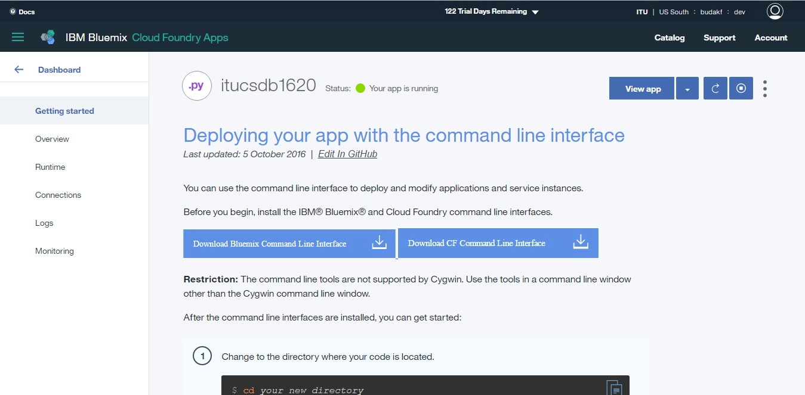
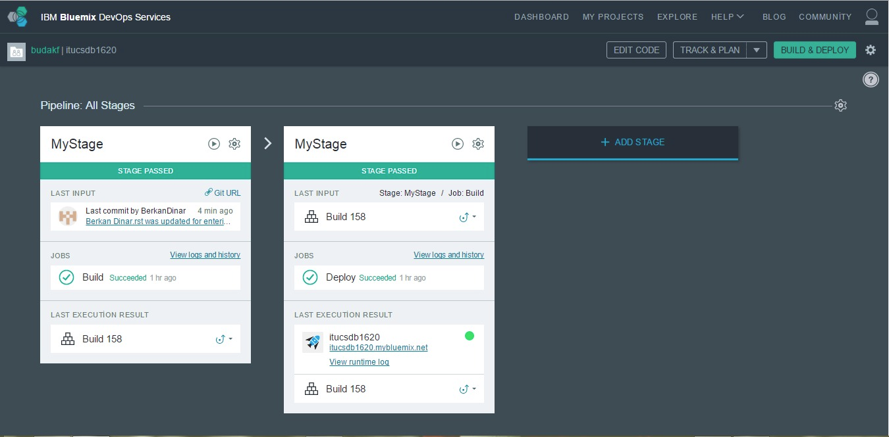
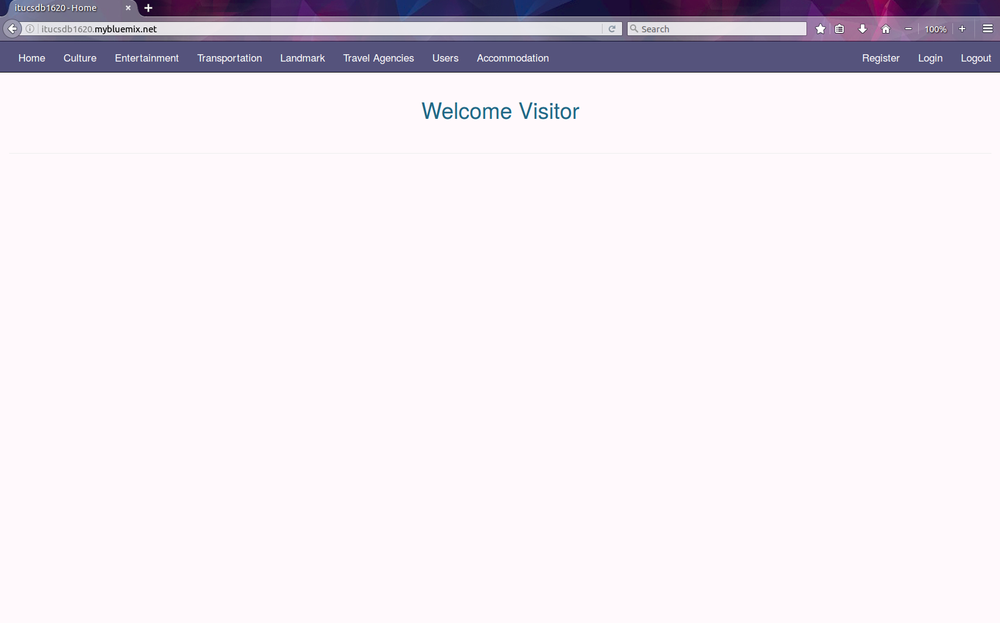

Installation Guide
++++++++++++++++++

1 Software/Tools/Languages Used for Developing the Project
==========================================================

**List of the software/tools/languages the project uses is as follows:**

   * Python with Flask framework and Psycopg2 extension

   * HTML

   * CSS and Bootstrap framework

   * Javascript

   * Postgresql

   * Vagrant with VirtualBox

   * Github for collaboration

   * Bluemix for deployment

1.1 Postgresql Database
-----------------------

**In order to edit and improve the project a local Postgresql database should be used for testing purposes**

Installing and configuring Postgresql Database done by the help of Vagrant and VirtualBox while development of this project, it is also the recommended approach. Nevertheless, it is possible to locally install and configure a Postgresql database but it will be more time consuming. Documentation for installation can be found in this site: https://www.postgresql.org/

1.2 Python and Flask Framework
------------------------------

**Python 3 or higher versions should be installed as well as Flask framework should be installed**

Python version 3 or higher can be installed from this site: https://www.python.org/downloads/

Flask framework can be installed from this site: http://flask.pocoo.org/

Psycopg2 extension can be installed from this site: http://initd.org/psycopg/

1.3 Integrated Development Environment (IDE)
--------------------------------------------

**An integrated development environment (IDE) such as "Eclipse" is highly recommended for organizing all the necessary files although it is not necessary**

      **An example IDE (Eclipse) can be very helpful**

1.4 Vagrant and VirtualBox
--------------------------

**If vagrant wanted to use for easily configuring the Postgresql database necessary files provided in the source code**

Vagrant can be downloaded from: https://www.vagrantup.com/downloads.html

VirtualBox can be downloaded from: https://www.virtualbox.org/wiki/Downloads

* After these downloaded and installed, "vagrant up" command should be executed in a terminal while in project folder.
* Phppgadmin is also provied with vagrant in this project folder. It is possible to access the database by the link: http://localhost:5080/phppgadmin
* Credentials the reach the database are as follows: "host='localhost' port=5432 dbname='itucsdb' username='vagrant' password='vagrant'"

1.5 Github
----------

**A Github account and a repository is required**

Github account can be created from: https://github.com/

* Then the project can be forked from: https://github.com/itucsdb1620/itucsdb1620

      **The repository of itucsdb1620**

1.6 Bluemix
-----------

**Bluemix is used for deploying this project to the web in this development process, any other such tool can be selected for this purpose**

Access to Bluemix Services provided with: https://hub.jazz.net/)

2 Minimal Tools Needed for Deploying This Application to the Web
================================================================

**These following tools provide a minimal approach to deploying this project, although editing and improving the project will be limited with github interfaces editting option which is highly discouraged without properly debugging the code in a local environment**

2.1 Github Account and a Repository on Github
---------------------------------------------

**The necessary information about Github setup is provied in section "1.5 Github" above**

2.2 Bluemix Account
-------------------

**The necessary information about Bluemix setup is provied in section "1.6 Bluemix" above**

3 Deployment Process
====================

* "Create Project" should be used for connecting Github repository with the Bluemix

      **The Create Project page**

* After correctly connecting with Github repository the project should appear on the main page

      **The Main page**

* ElephantSql connection can be done here

      **The ElepantSql connection page**

* The system can be monitored here

      **The System monitoring page**

* Log screen is also provided here

      **The Logging page**

* If additional information needed about deployment, Bluemix provies it in this page

      **The Guide page for deployment process provided by Bluemix**

* In the "Build&Deploy" page these steps should be executed

      **The deployment page after successfully done**

* After deployment process is completed, the website can be reached by: http://itucsdb1620.mybluemix.net/

      **The website is ready to use**

